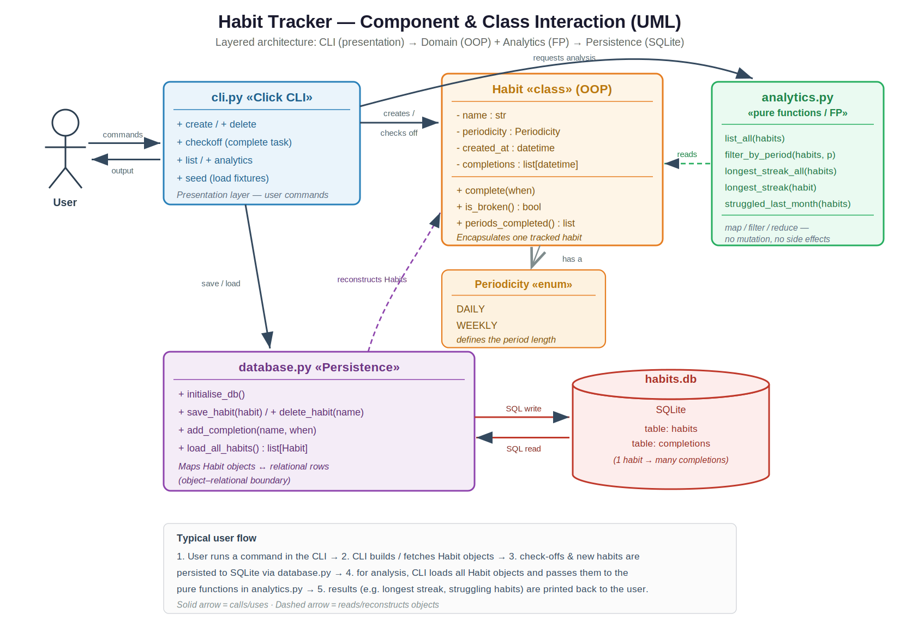
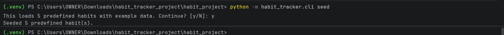
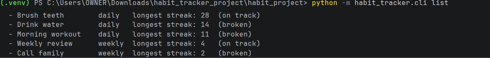
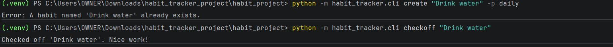
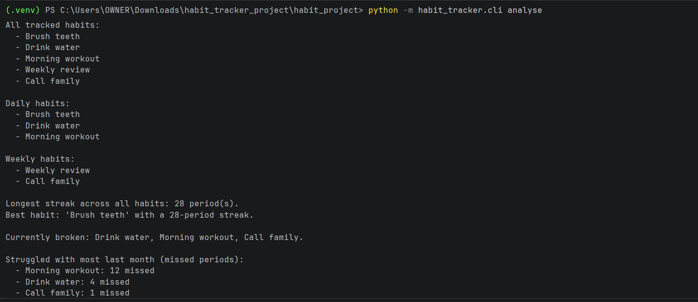
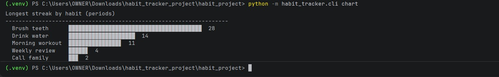
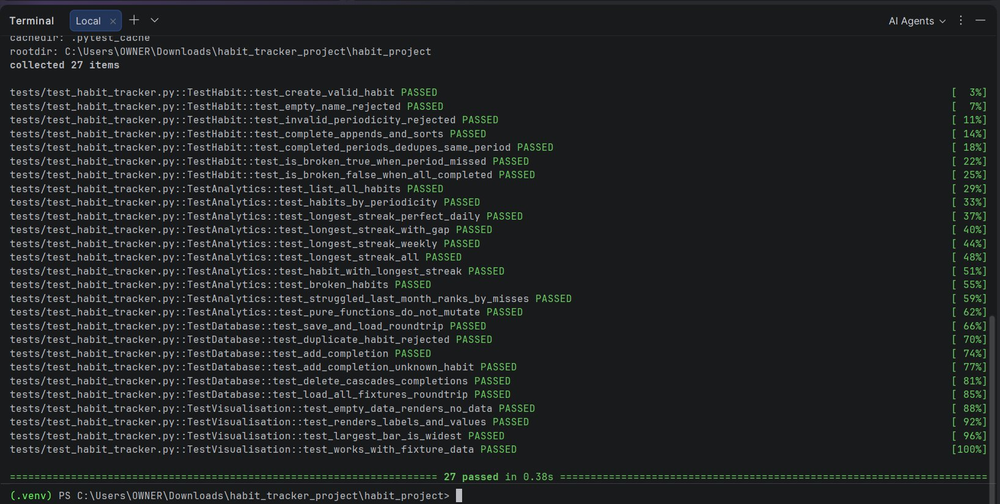

# Habit Tracker

A small, well-tested **habit tracking backend** written in Python, combining
**object-oriented** and **functional** programming. It lets a user define
daily and weekly habits, check them off, persist them in a SQLite database,
and analyse them — streaks, broken habits, struggling habits — through a
clean command-line interface.


> Submitted as a portfolio project for the IU course
> *Object Oriented and Functional Programming with Python* (DLBDSOOFPP01).

---

## Highlights

- **Object-oriented** domain model — a `Habit` class encapsulates the
  habit, its periodicity, and its event-log of completions.
- **Functional** analytics — pure functions built from `map`, `filter`,
  and `reduce`, with no mutation or side effects.
- **SQLite** persistence — relational storage (two tables) keeps the data
  durable between sessions; one module owns all the SQL.
- **Click** CLI — clear sub-commands (`create`, `checkoff`, `list`,
  `analyse`, `chart`, `seed`, `delete`).
- **5 predefined habits** with **4 weeks** of deterministic example data,
  doubling as a test fixture.
- **27 unit tests** covering every layer; full suite runs in under a
  second.

---

## Architecture

The project is split into clearly separated modules — one responsibility each:

| Module | Layer | Responsibility |
|--------|-------|----------------|
| `habit_tracker/habit.py` | Domain (OOP) | The `Habit` class and `Periodicity` enum; all streak / break rules. |
| `habit_tracker/analytics.py` | Analytics (FP) | Pure functions that analyse a list of habits. |
| `habit_tracker/database.py` | Persistence | SQLite storage; the only module that knows SQL. |
| `habit_tracker/cli.py` | Presentation | The Click command-line interface. |
| `habit_tracker/visualisation.py` | Presentation | ASCII bar-chart rendering helper. |
| `habit_tracker/fixtures.py` | Test data | 5 predefined habits with 4 weeks of example data. |



---

## Requirements

- Python **3.7 or later** (developed and tested on 3.13)
- [Click](https://click.palletsprojects.com/) for the CLI
- [pytest](https://pytest.org/) to run the test suite

Everything else (`sqlite3`, `datetime`, `enum`, `functools`) is in the
Python standard library.

---

## Installation

Clone the repository and install the dependencies into a virtual environment:

```bash
git clone https://github.com/<your-username>/oofpp_habits_project.git
cd oofpp_habits_project

# Create and activate a virtual environment
python -m venv .venv
source .venv/bin/activate           # Linux / macOS
.venv\Scripts\Activate.ps1          # Windows (PowerShell)

# Install dependencies
pip install -r requirements.txt
```

Optionally, install the project so the `habit` command is available directly:

```bash
pip install -e .
```

---

## Usage

You can run the CLI either as a module or, if installed, via the `habit` command.
The examples below use the module form.

### 1. Load the example data (recommended first step)

```bash
python -m habit_tracker.cli seed
```

This loads the five predefined habits, each with four weeks of tracking data, so
you can explore the app immediately.



### 2. List your habits

```bash
python -m habit_tracker.cli list                 # all habits
python -m habit_tracker.cli list -p daily        # only daily habits
```



### 3. Create a habit and check it off

```bash
python -m habit_tracker.cli create "Drink water" --periodicity daily
python -m habit_tracker.cli checkoff "Drink water"
```



> The duplicate-name error above is intentional — `Drink water` was already
> seeded, so the database refused the duplicate. The `checkoff` then succeeded
> on the existing habit.

### 4. Analyse your habits

```bash
python -m habit_tracker.cli analyse
```

Reports all tracked habits, habits grouped by periodicity, the longest streak
overall and per habit, which habits are currently broken, and which you
struggled with most over the last month.



### 5. Chart your streaks

```bash
python -m habit_tracker.cli chart
python -m habit_tracker.cli chart -p daily       # daily habits only
python -m habit_tracker.cli chart --width 60     # wider bars
```

Renders an ASCII bar chart of the longest streak for each habit, right in the
terminal.



### 6. Delete a habit

```bash
python -m habit_tracker.cli delete "Drink water"
```

By default data is stored in `habits.db` in the current directory. Use a
different file with the global `--db` option:

```bash
python -m habit_tracker.cli --db my_habits.db list
```

Run `--help` on any command to see its options:

```bash
python -m habit_tracker.cli --help
python -m habit_tracker.cli create --help
```

---

## Running the tests

From the project root:

```bash
pytest -v
# or, equivalently:
python -m pytest -v
```

The suite covers four areas:

- **`TestHabit`** — the `Habit` class, including streaks, break detection, and
  validation (creation, periodicity rules).
- **`TestAnalytics`** — every analytics function, validated against the
  deterministic fixture data.
- **`TestDatabase`** — the full SQLite round-trip, including duplicate
  rejection, completion logging, and cascade delete.
- **`TestVisualisation`** — the ASCII bar-chart renderer.



All 27 tests pass in under a second on a typical machine.

---

## How the core concepts are modelled

- A **habit** is a task that must be completed at least once per period.
- A **period** is a fixed window (1 day for daily habits, 7 days for weekly
  ones), counted from the habit's creation date.
- A **check-off** is a timestamped completion stored in the event log.
- A habit is **broken** if any period before the current one had no
  completion.
- A **streak** is the longest run of consecutive completed periods.

Crucially, the streak calculation **respects each habit's periodicity** — a
daily habit's streak is measured in days, a weekly habit's in weeks. The
`Habit.period_index()` helper does this by dividing elapsed time by
`self.periodicity.length`, so the same code correctly handles both.

---

## The 5 predefined habits

| Habit            | Periodicity | 4-week pattern               | Longest streak |
|------------------|-------------|------------------------------|----------------|
| Brush teeth      | daily       | every day — perfect          | 28             |
| Drink water      | daily       | gap on days 10–13            | 14             |
| Morning workout  | daily       | struggled recently           | 11             |
| Weekly review    | weekly      | all 4 weeks                  | 4              |
| Call family      | weekly      | missed week 3                | 2              |

The deliberate gaps give the streak, broken-habit and "struggled last month"
analytics something real to detect — and let the unit tests assert exact,
known numbers.

---

## Project layout

```
oofpp_habits_project/
├── habit_tracker/
│   ├── __init__.py
│   ├── habit.py              # OOP domain model
│   ├── analytics.py          # functional analytics
│   ├── database.py           # SQLite persistence
│   ├── cli.py                # Click CLI
│   ├── visualisation.py      # ASCII bar chart
│   └── fixtures.py           # predefined habits + 4 weeks of data
├── tests/
│   └── test_habit_tracker.py
├── docs/
│   └── screenshots/          # README screenshots
├── requirements.txt
├── setup.py
├── .gitignore
└── README.md
```

---

## Author

Built by **Opene, Obiajulu Racheal** as part of the IU Bachelor of Data
Science programme (course DLBDSOOFPP01).

## License

MIT — see [LICENSE](LICENSE) for details.
